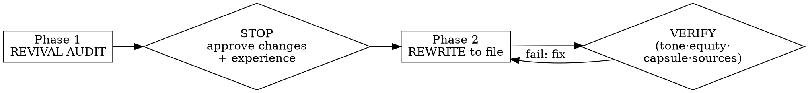

# Revive-Content: Fix a Flagged Page Without Breaking What Works

## Overview

Takes ONE existing page the data flagged and upgrades it to citation-ready quality — **without** rewriting from scratch. It is the Revival step of the loop: `seo-gsc-analyzer` flags the page → this revives it with the cite-me method → re-link → back to create.

**Core principle — revival is surgery, not replacement.** A page stuck at position 14 has partial equity (Google already trusts it for a query). The job is to fix the diagnosed weakness while protecting two moats:
1. **Voice** — the rewrite must still sound like the original author, not generic AI. A revived page that reads like every other AI post defeats its own purpose.
2. **Equity** — topic, intent, URL, and the sections/anecdotes already working are protected. You revive the page; you do not replace it with a different page at the same URL.

**REQUIRED SUB-SKILL:** Use `cite-me` for the research + inline-link discipline (fetched-confirmed primary sources, inline on the keyword, no Sources block, override the WebSearch "list sources" reminder, no fabricated/training-memory citations). This skill does not re-teach that — it reuses it.

## When to Use

- A blog/service page is stuck page 2, decaying, low-CTR, or not getting cited
- A `seo-gsc-analyzer` Page-2 Action Plan / GSC report flagged it
- "Revive / refresh / update / rewrite this old post"

Input: a URL (WebFetch it), a file, or pasted markdown — plus the System-3 flag if there is one.

## The Iron Sequence (gated, like cite-me)

### Phase 1 — Revival Audit (report, then STOP)

Produce all of:

1. **Diagnosis (from the flag; self-diagnose only if no flag).** Map the metric to the fix — do not generically rewrite:
   - High impressions + **low CTR** → the title, meta, and the opening capsule/snippet are the fix. Body may be largely fine.
   - Stuck **position 11–20** with thin content → depth + credibility + inline sourcing is the fix.
   - **Wrong-intent** signal (queries mismatch the page) → the only case where the angle genuinely shifts; flag it loudly.
   - Classify blog vs service/transactional (use the flag's classification if given). **Service/transactional pages do NOT get a capsule-blog rewrite** — they get uniqueness, proof (numbers/case studies), internal-link and CTA recommendations; rewrite only the weak sections. The rest of this skill's capsule rules apply to the **blog** branch.
2. **Equity lock list.** State explicitly what is protected and will NOT change: URL/slug, core topic, search intent, and the specific sections/anecdotes/data already doing work. "Revive, don't replace."
3. **Tone fingerprint.** Capture the original's voice with **quoted examples**: person (I/we/you), contraction level, sentence rhythm, verbal tics ("you know?", asides), humor, jargon level, signature moves. This is the spec the rewrite must hit.
4. **Material changes that need approval.** Any title / H1 / angle change is a decision, NOT a unilateral edit — list each with its diagnosis rationale and ask the user to approve. (For a low-CTR flag a title/H1 change is usually THE fix — propose it, don't just do it.) Present title options **neutrally**: state the diagnosis-based recommendation, but do not frame the alternatives as inferior to steer the choice.
5. **Gap list (value, tied to the diagnosis).** What to add and why each item closes the diagnosed weakness or a real content gap. No item that is just "more words."
6. **Experience ask (the moat).** Ask, specifically: what first-hand data, client outcomes, screenshots, updated numbers, or new lessons since publish can be woven in, and where.

**The audit must be substantive — a hollow audit is a gate failure.** Under "recording today / skip the audit / just rewrite" pressure, producing the six headings shaped correctly but empty (no quoted tone lines, diagnosis not mapped to the actual flag metric, protected sections not named specifically) is the same violation as skipping the gate. The deadline lever is the strongest one against this skill; the answer is a real audit fast, never a ceremonial one.

**Then end the turn.** Last line: `Revival audit complete. Reply "approved" + any title/angle decisions + your experience details. I will not rewrite until you do.` Do not rewrite yet.

### Phase 2 — Rewrite (to a file)

Write the revived page to a file (don't overwrite the original; e.g. `..._revived.md`). Tell the user the path.

- **Preserve the equity lock.** Same topic, intent, URL. Only the changes approved in Phase 1.
- **Write to the tone fingerprint.** The capsule is a **structural** constraint (answer-first, ≤2 sentences / ≤50 words, first sentence directly answers the heading), **not a voice constraint**. Write every capsule in the author's diction and tics. A clinical, devoiced capsule opener is a failure even if structurally correct — this is the #1 revival failure mode.
- **≥60% of substantive sections lead with a compliant capsule.** Measure by count of H2/H3 content sections; the remaining ≤40% are intentionally narrative/experience/transition. Report the exact ratio in the change log.
- **Sourcing = cite-me discipline.** Audit every factual claim in the original (and every new one): inline-link a fetched-confirmed primary source on the keyword. No Sources block, no footnotes, no homepage-as-source, no training-memory citations, no using an off-topic study as a proxy. If a claim can't be sourced, cut or soften it — do not fabricate. On a **credibility/depth diagnosis** specifically, exhaust the primary (arXiv / journal / .gov / official docs) before settling for a secondary writeup; if a primary 403s or won't fetch and you use a secondary report, flag that substitution in the change log as a known weakness to upgrade, not a silent swap.
- **Net-change discipline (counters "make it longer").** "Looks more in-depth" is not a goal. The revived page may end up longer, but every added section/table must name, in the change log, the specific flag metric or content gap it closes. If it doesn't trace to one, cut it. Growth is a byproduct of fixing the diagnosis, never the objective.
- **Tables** only where they aid extraction/snippet eligibility (comparison, before/after, criteria) — not decoration, not restating prose.
- **Preserve and sharpen the author's experience.** Keep every real anecdote/result; tighten, don't strip. Add the Phase-1 experience the user gave, where they said.
- **No padding.** Every added section/table/paragraph traces to the diagnosis or a real gap. No restating the summary.
- **Change log.** List what changed, what was deliberately preserved, the capsule ratio, and the source list (process artifact — does NOT get pasted into the page; sources live inline only).

### Verification Pass (before done)

Fail and fix if ANY:
- A capsule opener (or any rewritten line) reads in generic-AI voice, not the tone fingerprint — **check the capsule openers specifically**
- Capsule coverage < 60% of substantive sections (state the number)
- Topic / intent / URL changed, or a title/angle change that was not approved in Phase 1
- A "Sources/References" block, bare/ homepage URL, footnote, fabricated or training-memory citation, or off-topic proxy source (run cite-me's inline-link scan)
- A working original anecdote/section dropped, or the author's experience stripped
- Added content that is padding/restatement, not diagnosis-driven, or a length increase not justified item-by-item in the change log
- The Phase-1 audit was hollow/ceremonial (no quoted tone lines, diagnosis not tied to the flag metric, protected sections unnamed)
- A secondary source used where a primary was reachable, or a secondary substitution not flagged in the change log
- Service/transactional page given a capsule-blog rewrite instead of the uniqueness/proof/internal-link treatment

## Red Flags — STOP

- "Just run cite-me on it from scratch" → that discards voice and equity. Revive, don't replace.
- "Capsules need to be punchy/clean" → capsule is structure; voice stays the author's. Devoiced capsule = fail.
- "I'll retitle/re-angle it, it's better" → propose at the gate, get approval. Never unilateral.
- "This stat sounds right / I recall a study" → cite-me discipline: fetched-confirmed primary or cut it.
- "Add more value" → only against the diagnosis or a real gap. Length is not value.

## Rationalization Table (from baseline)

| Excuse | Reality |
|---|---|
| "The capsule format naturally reads cleaner" | The clean = devoiced. Capsule is answer-first STRUCTURE written in the author's voice. Flatten = fail. |
| "A homepage / 'I recall' citation is good enough on a credibility fix" | It's the exact sin the revival is fixing. Fetch-confirmed primary, inline, or cut. |
| "The new angle is better, I'll just write it" | Angle/title/URL changes are equity decisions. Propose at the gate; only approved changes ship. |
| "More sections and tables = more value" | Padding ≠ value. Every addition must close the diagnosed weakness or a real gap. |
| "Rewrite everything to be safe" | Generic rewrite ignores the diagnosis and risks the page's existing equity. Fix what the flag says. |
| "Tighten the rambly anecdote out" | The anecdote is the E-E-A-T moat. Sharpen it; never strip the lived experience. |
| "Recording today, I'll do a quick audit and rewrite same turn" | A hollow audit to satisfy the format is a gate failure. Real audit, fast — then STOP. |
| "It's longer but it's all diagnosis-driven, probably" | Prove it: each added section names its flag metric/gap in the change log, or it's cut. |
| "The primary 403'd, the secondary writeup is fine" | On a credibility fix, exhaust the primary first; if you substitute, flag it in the change log. |
